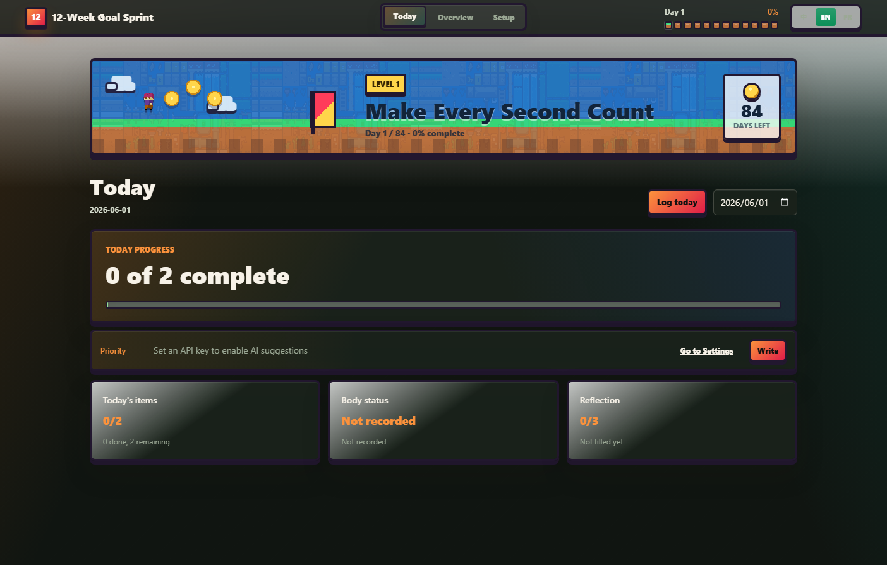
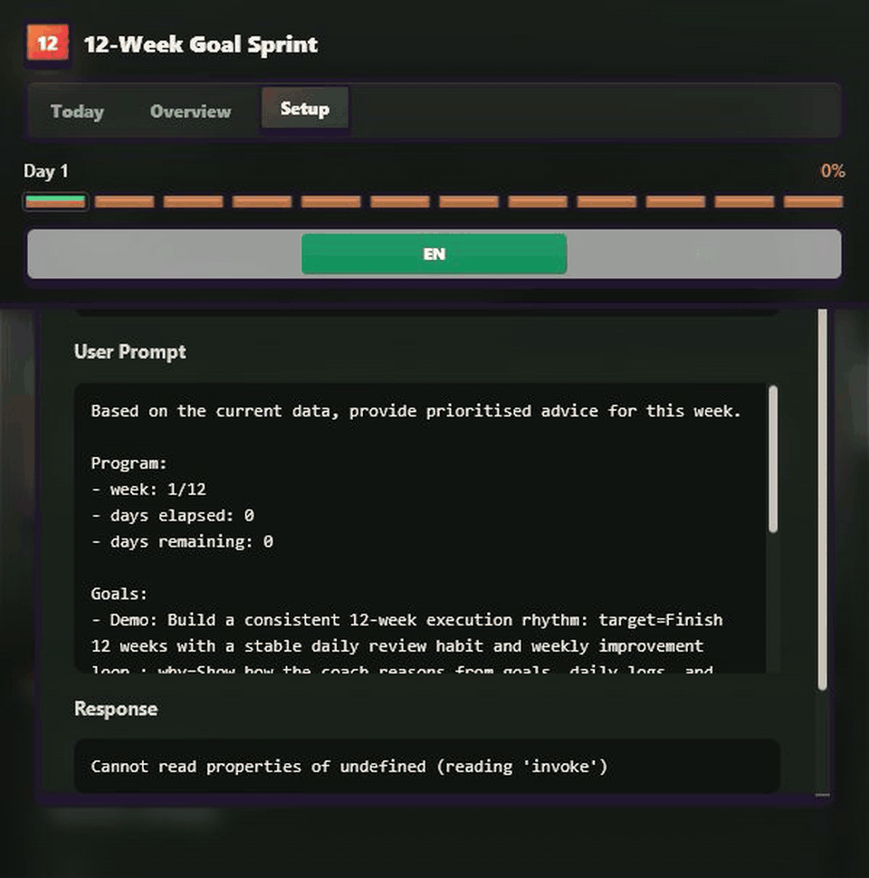
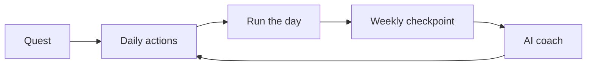
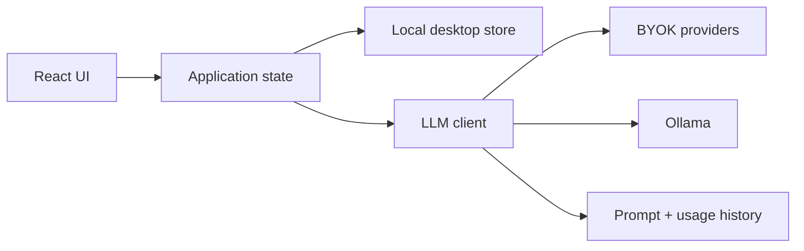
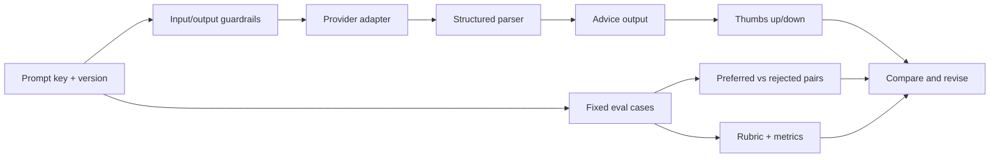

# 12wy-tracker

[Download latest release](https://github.com/zoetw88/12wy-tracker/releases/latest) · [Watch the demo](screenshots/demo.gif)


Private local desktop app for running a 12 Week Year workflow as a game-like execution system: quests, daily actions, season progress, and inspectable AI coaching.





## Scope

This is not an enterprise LLM platform. It is a finished local desktop slice with a proportional LLM quality loop: prompt versions, usage logs, preference cases, reports, and a small repo-owned preference sanity runner.

## Built Surface

| Capability | What is implemented |
|---|---|
| Planning loop | Weighted 12-week quests, daily actions, weekly checkpoint |
| Desktop app | Tauri shell with local storage |
| Save file | Active-profile export, import, and delete; API keys excluded from exports |
| AI options | BYOK hosted providers and Ollama local endpoint |
| AI log | Prompt text, key/version, provider, model, local budget, latency, estimated cost |
| Quality loop | Eval cases, preference pairs, rubric scoring, usage metrics, thumbs up/down feedback |

## Product Loop



## Architecture



## AI Safety And Quality



Guardrails are local and deterministic: control-character cleanup, bidi override removal, prompt/response length caps, structured parsing, sanitized provider errors, timeout/retry handling, missing-key states, and failed-attempt logging.

## Key Tradeoffs

| Decision | Reason |
|---|---|
| Local-first before cloud sync | Private goals and reflections should work without an account |
| BYOK before managed AI | No hidden inference cost and no shared provider key risk |
| Ollama support | Local model option for private prompts |
| Local guardrails, not gateway | Correct scope for a personal desktop app |
| AI mana cap | Local estimated-cost budget before hosted-provider calls |
| AI log | Coach advice can be audited instead of trusted blindly |

## External Tool Boundaries

| Tool | Boundary |
|---|---|
| promptfoo | Dev/CI harness for prompt regression, model comparison, and red-team runs; not part of production runtime |
| Langfuse | Optional development observer; sends traces only when dev env keys are configured, otherwise silently skips |
| OpenTelemetry | Long-term observability direction if the app grows beyond local desktop use |

## Stack

Tauri 2, React 19, TypeScript, Vite, Rust desktop shell, embedded local store.

Providers: Gemini, Groq, OpenAI, Anthropic, DeepSeek, Kimi, Ollama.

## Run

```bash
cd app
npm install
npm run tauri dev
npm test
npm run build
```

Sample eval report:

```bash
cd eval
npm run report:sample
npm run report:preferences
```

Provider-backed evals require a configured model key:

```bash
cd eval
npm run eval
npm run eval:preferences
```

## License

[PolyForm Noncommercial 1.0.0](LICENSE) - personal and research use are OK. Commercial use requires separate permission.
